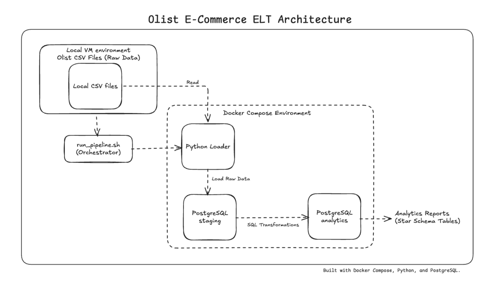
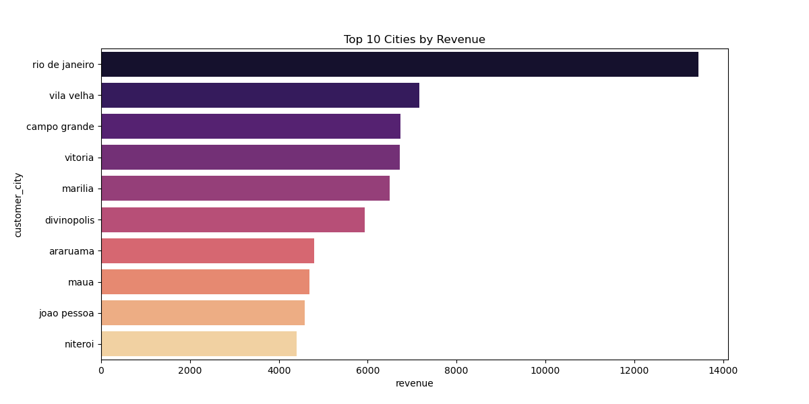
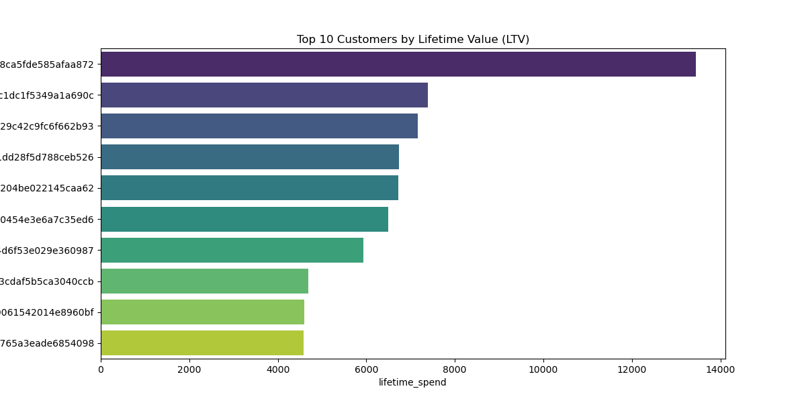

# Containerized ELT Pipeline

A production-ready ELT (Extract, Load, Transform) pipeline that orchestrates the ingestion and transformation of [Brazilian e-commerce data](https://www.kaggle.com/datasets/olistbr/brazilian-ecommerce). This project leverages Docker for environment isolation, PostgreSQL as the data warehouse, and dbt for dimensional modeling and data quality assurance.

## Architecture and Tech Stack

* **Orchestration:** Docker and Docker Compose
* **Storage:** PostgreSQL (OLAP)
* **Transformation:** dbt (Data Build Tool)
* **Scripting:** Python (ELT) and Bash (Workflow Automation)
---
## Project Structure
```
.
├── assets/               # Screenshots of SQL logic, Lineage, and Dashboards
├── data/                 # Raw Olist CSV files (Local only, ignored by Git)
├── scripts/              # SQL transformation scripts
├── .gitignore            # Prevents .env and data/ from being uploaded
├── docker-compose.yml    # Defines Postgres and App containers
├── main.py               # Python logic for Loading data
├── README.md             # Project documentation
└── run_pipeline.sh       # Bash script to orchestrate the entire flow
```
---

## Data Modeling and Lineage
I implemented a **Star Schema** approach (or whatever your SQL code builds) to optimize for analytical queries:
- **Fact Table:** `fact_orders` (containing order values and timestamps).
- **Dimension Tables:** `dim_customers`, `dim_products`, and `dim_sellers`.

### Lineage Graph

* **Source Layer:** Ingested raw data including dim_customers, fact_orders, dim_products, and fact_order_items.
* **Transformation Layer:** Modular SQL logic for complex metrics such as Customer Lifetime Value (LTV) and Monthly Revenue Growth.
* **Mart Layer:** Business-ready tables like mart_category_profit, designed for direct consumption by BI tools.

---

## Data Quality and Reliability
To ensure data integrity, I implemented an automated testing suite within the dbt lifecycle:

* **Custom Business Logic Tests:** Created `assert_positive_revenue` to catch cases where revenue might be reported as zero or negative before it reaches final reporting.
* **Schema Validation:** Enforced `unique` and `not_null` constraints on primary keys across all fact and dimension tables.

---

## Sample Compiled SQL: mart_category_profit
This model demonstrates the logic used to calculate profitability at the category level, including shipping margins and volume filtering.


```sql
SELECT
    p.product_category_name,
    COUNT(i.order_id) as total_sales_count,
    SUM(i.price) as total_revenue,
    SUM(i.freight_value) as total_shipping_costs,
    ROUND((SUM(i.price) / (SUM(i.price) + SUM(i.freight_value)))::numeric, 3) as margin_ratio
FROM dim_products p
JOIN fact_order_items i ON p.product_id = i.product_id
GROUP BY 1
HAVING COUNT(i.order_id) > 100
ORDER BY margin_ratio DESC
```
---

## Key Business Findings

### 1. Revenue Trends
The **Monthly Revenue Trend** chart reveals a classic startup growth trajectory:
- Rapid Expansion: From January 2017 to late 2017, revenue climbed from near zero to over $1,000,000 per month.
- Volatility: There is a notable dip in early 2018 (February), followed by a swift recovery to peak levels in May 2018.
- Data Cut-off: The sharp drop to zero in late 2018 is likely an "artifact" of the dataset ending mid-month, rather than a total business collapse.


### 2. Geography
The **Top 10 Cities by Revenue** chart proves that market concentration is heavily skewed toward major hubs:
- Rio de Janeiro's Lead: Rio is the clear winner, generating over $13,000 in this specific sample—nearly double the revenue of Vila Velha in 2nd place.
- Market Concentration: Revenue drops off quickly after the top city, indicating that marketing and logistics efforts should likely remain focused on the top 3 urban centers for maximum ROI.


### 3. Customer Value
The **Top 10 Customers by LTV** chart highlights a massive disparity in individual customer worth:
- The "Whale" Effect: Your #1 customer (ID ending in ...aa872) has spent over $13,000, which is nearly double the 2nd place customer.
- LTV Stability: Most other top-tier customers fall within a tight range of $4,000 to $7,000.
- Business Insight: This suggests that Olist has a small segment of high-value "power users" or professional buyers who represent a disproportionate share of revenue.

---

## Cloning
Follow these instructions to replicate the environment and run the data pipeline locally.

### Prerequisites
Docker and Docker Compose installed.

### Git installed.

A PostgreSQL client (optional, for manual verification).

### Installation and Setup
Clone the repository:

```
git clone https://github.com/ananyagullapally/containerized-elt-pipeline.git
cd containerized-elt-pipeline
```
Launch the stack:

```
docker-compose up -d
```
Execute the Pipeline:

```
bash run_pipeline.sh
```
